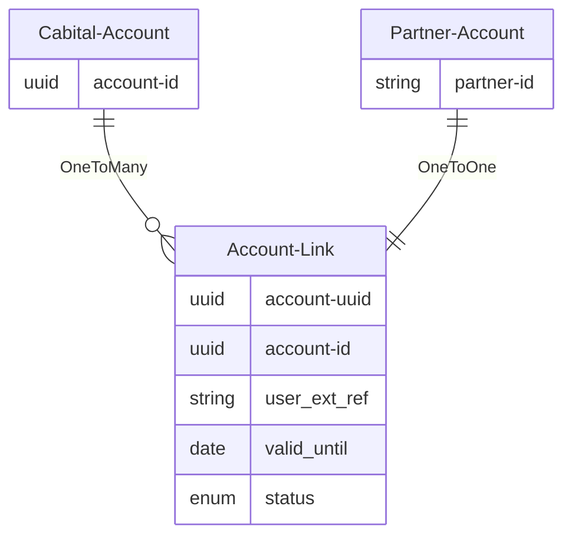

# Account Link


`Account Link` 是一种特殊的 Connect 业务模式，在此模式下，业务对手方支持多对一（包含一对一）的账户关联关系。

## Account Link 关系:

`Account-Link`




## Link的具体方式：

```mermaid
graph TD
st[Partner Login]
op[Access Cabital Connect]
check{Is Connected?}
auth_wall{Has Account?}
account_check{Valid Account Id?}
login[Login]
onboard[Onboading]
connect[Kick Off Connect]
partner_api[Call API with V-Account ID]
connected[Confirm Connection]
callback[V-Account Callback]
transfer[Transfer/Convert API]
%%{`token[Fetch Widget Token]widget[Launch Widget]paid[Transfer Callback]debit[Infinit Debit API]recon[Confirm by Recon API]`}%%
st:::partner-->op:::partner-->check:::partner
check-->|Yes|partner_api
check-->|No|connect
connect:::partner-->auth_wall
subgraph Cabital Connect
auth_wall-->|Yes|login
auth_wall-->|No|onboard
login-->connected
onboard-->connected
end
connected-.->callback:::partner
partner_api:::partner-->account_check
%%{`account_check-->|Yes-H5|token-- Token & Ext_id -->widget`}%%
account_check-->|Yes|transfer:::partner
account_check-->|No|connect
%%{`transfer-.->paid:::partner transfer-->debit:::partner paid-->recon`}%%

classDef partner fill:#7FFFD4;
```


## 开始link

```shell
curl "https://api.cabital.com/api/v1/partner/link"
```

### HTTP 请求

`GET /api/v1/partner/link?partner_key=<partner_key>&user_ext_ref=<external_id>&feature=xxx`

### URL参数

| 参数         | 是否必须 | 描述                                                         |
| ------------ | -------- | ------------------------------------------------------------ |
| partner_key  | true     | Cabital Issue给Partner唯一的标识Partner Key                  |
| user_ext_ref | true     | Partner在开始Link的时候唯一的user_ext_ref，在Partner侧具有唯一性 |
| feature      | false    | deeplink跳转，非必需，可以直接跳到2FA，KYC，或者Link确认页面 |
| redirect_url | false    | Cabital在Link成功后浏览器redirect，需要encoding              |
| siganture    | true     | 根据下附上的计算方式                                         |

### 签名方式

- ACCESS-KEY 客户的Access Key，请联系服务顾问获取
- ACCESS-SIGN 在客户系统中根据下面的规则生成的消息签名

ACCESS-SIGN是通过sha256 HMAC的算法以Secret Key计算除去`signature`之外的完整`URL`，例如`https://api.cabital.com/api/v1/partner/link?partner_key=latibac&user_ext_ref=1234567890&feature=link`


> 获得以下Response


```json
Resposne Code : 303
Url : 我方提供的页面
```


## 获取用户关联状况


```shell
curl "http://partner.cabital.com/api/v1/link/links/cdaa9983-9b8f-4478-ba60-896ac239879d"
```

### HTTP 请求

`GET /api/v1/links/user_ext_ref`

### URL参数

| 参数         | 是否必须 | 描述                |
| ------------ | -------- | ------------------- |
| user_ext_ref | true     | Connect的外部账户id |

> 获得以下JSON结构体:

```json
{
  "account_uuid": "6d92e7b4-715c-4ce3-a028-19f1c8c9fa6c",
  "link_status": "LINKED",
  "otp_ready": true,
  "kyc_status": "KYC_PASS",
  "email_address": "john.doe@email.com",
  "valid_until": 1648836455
}
```


| 字段          | 类型              | 描述                                                         |
| ------------- | ----------------- | ------------------------------------------------------------ |
| link_status   | string(ENUM)      | 账户关联状态                                                 |
| account_uuid  | string            | Link后的虚拟Account ID                                       |
| otp_ready     | bool              | 客户是否已经在 Cabital 绑定完成OTP，其在提现的时候需要附上   |
| kyc_status    | enum              | 客户的KYC状态，其决定了是否已经开户成功                      |
| email_address | string            | 用户在本方的 Email， 供合作方匹配                            |
| valid_until   | number(timestamp) | 以秒为单位从Unix Epoch到当前的数字，用来表示该Link的有效时间，非必需 |


## Partner提供接口（Callback）

```shell
curl -X POST "http://api.partner.com/link"
```

### HTTP 请求

` POST 合作方提供URL`

### 请求体

| 字段        | 类型              | 描述                                                         |
| ----------- | ----------------- | ------------------------------------------------------------ |
| user_ext_ref | string            | Partner在开始Link的时候唯一的external_id，在Partner侧具有唯一性 |
| account_uuid  | string            | Link后的虚拟Account ID                                       |
| staus      | string            | 当前Link状态的最终状态 |
| event_time     | timestamp | 事件产生的时间，格式为[ISO 8601](https://en.wikipedia.org/wiki/ISO_8601) |
| data -> valid_until | number(timestamp) | 以秒为单位从Unix Epoch到当前的数字，用来表示该Link的有效时间，非必需 |

> 获得以下JSON结构体:

```json
{
    "account_uuid": "6d92e7b4-715c-4ce3-a028-19f1c8c9fa6c",
    "user_ext_ref": "fce4fd45-7dd7-4d4c-b06c-e17ff12f3e30",
    "staus": "LINKED",
    "event_time": "2020-07-01T09:00:00.000Z",
    "data" : {
      "valid_until": 1648836455
    }
}
```

### 重试规则

由于无法保证Partner的API可用性，所以在特殊情况下，Callback会按照标准Webhook的的重试机制总共尝试5次，直到第一次成功（2xx）或者全部失败，其频率参考Webhook的规则。


## Partner提供接口（Profile）

```shell
curl -X GET "http://api.partner.com/profiles/<user_ext_ref>"
```

### HTTP 请求

` GET 合作方提供URL`

### URL参数

| 参数         | 是否必须 | 描述                                                        |
| ------------ | -------- | ----------------------------------------------------------- |
| user_ext_ref | true     | Connect的外部账户id，如需要支持email，需要支持传入Email地址 |

> 获得以下JSON结构体:

```json
{
    "user_ext_ref": "fce4fd45-7dd7-4d4c-b06c-e17ff12f3e30",
    "preferred_username": "John Doe",
    "email": "jo****oe@a***s.com",
  	"picture": "https://cdn.partner.com/avatars/fce4fd45-7dd7-4d4c-b06c-e17ff12f3e30.png"
}
```

### 返回profile对象描述

| 字段               | 类型              | 描述                                                |
| ------------------ | ----------------- | --------------------------------------------------- |
| sub                | string(string)    | Connect的外部Partner账户的唯一id，                  |
| preferred_username | string            | 合作方用户名，默认显示项                            |
| email              | string            | 合作方账户的email，非必需，可以混淆后传输，仅供显示 |
| picture            | string(image url) | 作为我方在显示用户在合作方的头像，非必需            |


## link状态与API访问权限


### KYC Match的结果 = 我方 User （X） 的 证件 （A） 与合作方 User （Y ）的证件 （B）的一致性比对结果 （是否？关联 LINK状态）

任何变化 都会 影响到 KYC Match 的结果


### 客户需要KYC Match的情况下

| Link状态 \ KYC MATCH | 符合         | 不符合   | 过程中                   |
| -------------------- | ------------ | -------- | ------------------------ |
| Linked               | Connected    | Rejected | Connecting（需要子状态） |
| Unlinked             | Disconnected | N/A      | N/A                      |

### 客户无需Match的情况下

| Link状态 \ KYC PASSED | 符合         | 不符合   | 过程中     |
| --------------------- | ------------ | -------- | ---------- |
| Linked                | Connected    | Rejected | Connecting |
| Unlinked              | Disconnected | N/A      | N/A        |


### 实际状态与API权限

| API \ Status   | Disconnected | Connected | Rejected | Connecting |
| -------------- | ------------ | --------- | -------- | ---------- |
| Account Detail | N            | Y         | Y        | Y          |
| Convert        | N            | Y         | N        | Y?         |
| Transfer       | N            | Y         | N        | N          |

