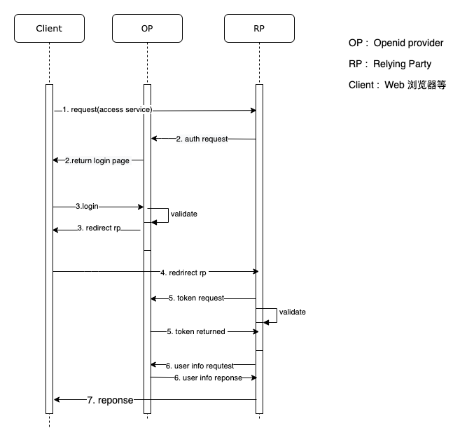
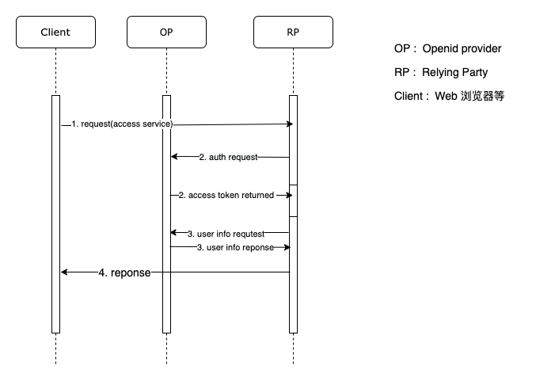
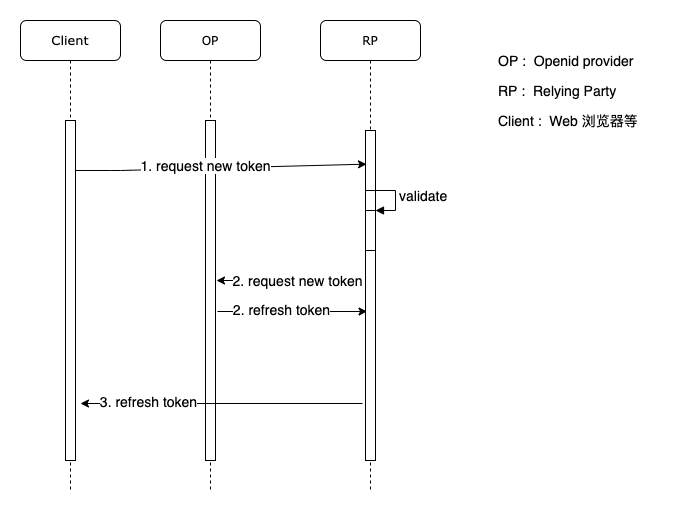

## Openid connect接入

### 1、概述

本文档主要描述使用OpenID协议接入Cabital方案。

Cabital目前支持使用OpenID Connect 1.0协议接入，详见https://openid.net/connect/。

常用的sdk library [参考](https://openid.net/developers/certified/)：


| 语言       | 库名字                                                       | License    | Conformance Profiles                                         |
| ---------- | ------------------------------------------------------------ | ---------- | ------------------------------------------------------------ |
| C#         | [IdentityModel.OidcClient 2.0](https://github.com/IdentityModel/IdentityModel.OidcClient2) | Apache 2.0 | Basic RP, Config RP                                          |
| Golang     | [OIDC v0.15.7](http://github.com/caos/oidc)                  | Apache 2.0 | Basic RP, Config RP                                          |
| JavaScript | [node openid-client](https://www.npmjs.com/package/openid-client) | MIT        | Basic RP, Implicit RP, Hybrid RP, Config RP, Dynamic RP, Form Post RP |
|            | [oidc-client-js 1.3](https://github.com/IdentityModel/oidc-client-js/) | Apache 2.0 | Implicit RP, Config RP                                       |
| PHP        | [phpOIDC 2016 Winter](https://bitbucket.org/PEOFIAMP/phpoidc) | Apache 2.0 | Basic RP, Implicit RP, Hybrid RP, Config RP, Dynamic RP      |
| Python     | [pyoidc 0.9.4](https://github.com/rohe/pyoidc)               | Apache 2.0 | Basic RP, Implicit RP, Hybrid RP, Config RP, Dynamic RP      |
|            | [oidcrp](https://github.com/IdentityPython/oidcrp)           | Apache 2.0 | Basic RP, Implicit RP, Hybrid RP, Config RP, Dynamic RP      |
| Ruby       | [openid_connect rubygem v1.0.3](https://github.com/nov/openid_connect) | MIT        | Basic RP                                                     |
| TypeScript | [angular-auth-oidc-client 1.0.2](https://github.com/damienbod/angular-auth-oidc-client) | MIT        | Implicit RP                                                  |
|            |                                                              |            |                                                              |

Cabital目前支持Authorization Code Flow 和 Implicit Flow。


### 2、接入方案

本文描述OpenID Connect (OIDC)接入方案。

#### 2.1 第三方接入准备

##### 2.1.1 准备和确认资料

合作方需提供给Cabital信息：

| 名称                     | 配置值                        |      |
| ------------------------ | ----------------------------- | ---- |
| Authorized origins       | https://partner.com                |      |
| Authorized redirect URIs | https://partner.com/callback |      |


Cabital提供给合作方的资料信息：

| 名称                 | 配置值                               | 备注                  |
| -------------------- | ------------------------------------ | --------------------- |
| Client ID            | `Client_ID`                          | OAuth 2 Client ID     |
| Client Secret        | `Client_SECRET`                      | OAuth 2 Client Secret |
| URL                  | https://domain                       | Domain URL，即后文中的Base-url            |
| openid-configuration | https://domain/{partner-id}/openid-configuration | openid-configuration  |


#### 2.2 Authentication(session不存在)

用户访问RP服务，Session不存在或invalid时，处理flow如下图所示：



1. Client访问应用程序资源服务RP。

2. PR发起auth请求到授权服务OP，OP经过验证返回并呈现登录⻚面。

3. Client输入登录信息，并授权发布信息，登录信息被发送到授权服务OP，经过验证后返回一个带有授权代
   码的重定向响应包。

4. Client将发起一个带有授权代码的重定向请求到RP。

5. RP接收带有授权代码的重定向请求，然后，它用授权代码向授权服务OP发出请求，授权服务OP验证授权代
   码并返回所有3个令牌： Access Token， Refresh Token， ID token

6. RP使用token访问userinfo，获取用户信息。

7. RP返回Client请求的资源响应。

   

#### 2.3  Authentication(session存在)

用户访问RP服务，Session存在，处理flow如下图所示：



1.  Client访问应用程序资源服务RP。
2.  PR发起auth请求到授权服务OP，授权服务OP验证授权代码并返回令牌。
3.  RP使用token访问userinfo，获取用户信息。
4.  RP返回Client请求的资源响应。


#### 2.4 Refresh Token

​        通常使用访问令牌可以鉴权用户能够访问的资源，但访问令牌通常具有有限的生命周期。在安全上，通过限制访问令牌的生命周期，可以限制攻击者使用被盗令牌的时间，从而一定程序上提高安全性。

​         当访问令牌过期或失效，但CLient仍然需要访问受保护的资源时，需要获取新的访问令牌，但不会强迫用户再次授予权限。Refresh Token可以解决这个问题。刷新Token允许在不提示用户的情况下获得新的访问令牌。

​        Client访问RP服务，Refresh token处理flow如下图所示：



1. Client发起刷新token请求，该请求带有refresh token。

2. RP发起带有refresh token的new token请求。

3. OP接收到refresh token的new token请求经过验证后返回refresh token。

4. Client收到refresh token返回信息。


#### 2.3 Revoke token

当Client登出时，需要清除session，此时需要revoke token。

 Client登出RP服务时，Revoke token处理flow如下图所示：


1. Client发起登出请求。

2. RP发起revoke token请求。

3. OP接收到revoke token的请求处理后返回结果，一般设置callback url，登出时返回到callback页面。

4. Client收到callback页面信息。


### 3、主要接口资源：

#### 3.1 auth request接口

RP(Relying Party) 向Client发送HTTP响应，指示它重定向到OP(OpenID Provider).

**本接口对应  场景2.2 创建Authentication中的step 2**

重定向URL

```
https://Base-url/{partner-id}/openid-connect/auth
```

主要支持参数：

| 参数          | **描述**                                                     |
| :------------ | :----------------------------------------------------------- |
| response_type | REQUIRED. Using the Authorization Code Flow， value is  ‘code’ |
| client_id     | REQUIRED. OAuth 2 Client identifier created by Cabital       |
| redirect_url  | REQUIRED. Redirection URI to which the response will be sent. This URI MUST exactly match one of the Redirection URI values for the Client pre-registered at Cabital |
| scope         | REQUIRED. See the scope options in the table below           |
| state         | OPTIONAL. Opaque value used to maintain state between the request and the callback. Returned as a URL parameter on the authentication response. |
| nonce         | OPTIONAL. String value used to associate a Client session with an ID Token, and to mitigate replay attacks. Returned as a parameter in the `id_token` |
| prompt        | OPTIONAL. Should contain value: ‘consent’. Required when ‘offline_access’ scope is requested, unless prompt for offline_access is disabled in Cabital for this service |


主要支持scopes：

| **Scope**      | **描述**                                                     |
| :------------- | :----------------------------------------------------------- |
| openid         | REQUIRED. Makes the Openid Connect authentication flow possible and includes the `id_token` in the response |
| profile        | OPTIONAL. To access the users ‘Userinfo’                     |
| email          | OPTIONAL. To include the users email address in the `id_token` |
| offline_access | OPTIONAL. To request a [Refresh token](https://kb.Cabital-on-it.com/en/service-integration/openidconnect/#refresh-tokens) |

使用HTTP 方法

*  GET: in that case, the parameters are URL encoded in the query string.
*  POST: the parameters are sent in the body of a request with `Content-Type: application/x-www-form-urlencoded`.

错误说明:

| **Check**                                                    | **Error code**            |
| :----------------------------------------------------------- | :------------------------ |
| The tenantId, if present in the request URL, must be known to Cabital. | invalid_request           |
| The response_type parameter must be “code”.                  | unsupported_response_type |
| The `client_id` must refer to a Service in Cabital for which OpenID has been configured. | invalid_client            |
| The `redirect_uri` must be known to Cabital for the Service. | invalid_request           |
| The scope must contain “openid”                              | invalid_scope             |

例子：

```shell
https://Base-url/tibyb/openid-connect/auth?client_id=demo-client&redirect_uri=http%3A%2F%2Flocalhost%3A3000%2Fcallback&response_type=code&scope=openid+profile&state=pnIj1g3GMsX0Rj6FDbVoe3rYbLJzdfejT0EfusiEbis%3D
```


#### 3.2 带授权code重定向RP

发起一个带有授权代码的重定向请求到RP。

**本接口对应  场景2.2 创建Authentication中的step 4**

使用HTTP 方法

*  GET: in that case, the parameters are URL encoded in the query string.

重定向请求带有如下参数：

| **Parameter name** | **Explanation**                                              |
| :----------------- | :----------------------------------------------------------- |
| code               | A code generated for the authentication request by Cabital. The Relying party must treat this code as an opaque value |
| state              | The value of the state parameter                             |

```shell
http://localhost:3000/callback?state=state&session_state=57a30714-91e5-4fd7-a917-a4c5c8563e24&code=642de989-2564-405a-a807-5a8d20952e09.57a30714-91e5-4fd7-a917-a4c5c8563e24.d3e0888f-61b1-4d42-b971-156397ba24b5
```


#### 3.3 Access token request

RP(relying party) 发送 授权code到Cabital.

**本接口对应  场景2.2 创建Authentication中的step 5**

请求URL

```
https://Base-url/{partner-id}/openid-connect/token
```

使用Basic authentication

The Relying party must authenticate itself using Basic authentication. Characters (%20-%&E) according to OAuth2 appendix A.2(https://tools.ietf.org/html/rfc6749#appendix-A.2).

使用HTTP 方法

*  POST: the parameters are sent in the body of a request with `Content-Type: application/x-www-form-urlencoded`.

请求使用参数：

| **Parameter name** | **Explanation**                                              |
| :----------------- | :----------------------------------------------------------- |
| grant_type         | The expected grant type. Must be the fixed value: authorization_code |
| code               | The code as received from Cabital in the Authentication response. This code may be used only once according to Oauth2 section 4.1.2(https://tools.ietf.org/html/rfc6749#section-4.1.2) |
| redirect_uri       | URI to send the authorization response back to. Must be the one that is registered in Cabital with the Relying Party |


#### 3.4 Access token reponse

错误说明:

如果处理失败，Cabital会发送错误响应信息。

| **Check**                                                    | **Error code**         |
| :----------------------------------------------------------- | :--------------------- |
| The basic authentication must be valid                       | unauthorized_client    |
| The response_type parameter must be “authorization_code”.    | unsupported_grant_type |
| The code must be known to Cabital and must have been generated for the Service identified by the basic authentication username. | invalid_request        |
| The redirect_uri must be known to Cabital for the Service.   | invalid_request        |


如果处理成功，则返回json报文，此时HTTP header设置”Content-Type: application/json“。

json对象字段如下：

| **Attribute name** | **Explanation**                                              |
| :----------------- | :----------------------------------------------------------- |
| access_token       | Token needed for sending a UserInfo request. The token is generated by Cabital and should be treated as an opaque value by the Relying Party |
| token_type         | The authorization type the token has been generated for, must be the fixed value: Bearer |
| expires_in         | Validity period of the `access_token`, in seconds            |
| id_token           | JSON Web Token with information about the authenticated end user and the request. |
| refresh_token      | Only when the scope in the request contains `offline_access`. More info, chapter: [Refresh tokens](https://kb.Cabital-on-it.com/en/service-integration/openidconnect/#refresh-tokens) |

id_token对象通常包含头，签名和内容体，其中payload作为json对象主要有如下信息：

| **Attribute name** | **Explanation**                                              |
| :----------------- | :----------------------------------------------------------- |
| iss                | Issuer of the token.                                         |
| sub                | The user identifier within Cabital, globally uniquely.       |
| aud                | Array of the `client_id` for which the token was generated and the tenantId of the user. |
| azp                | The `client_id` for which the token was generated.           |
| auth_time          | Unix timestamp (rfc3339) of the time at which the user has been successfully authenticated |
| exp                | Time until the JWT is valid as a Unix timestamp (rfc3339)    |
| iat                | Unix timestamp (rfc3339) at which the JWT was generated      |
| nonce              | The exact same value as the nonce in the authentication request |
| email              | Email address of the user. Only when requested as a `scope` in the authentication request |

如下所示：

```json
        "exp": 1632897475,
        "iat": 1632897175,
        "auth_time": 1632895778,
        "jti": "cd43fd67-fe99-4aa0-81f5-9c4e4bf099a1",
        "iss": "https://authserver.latibac.com/auth/realms/tibyb",
        "aud": "demo-client",
        "sub": "2cdcae60-a52c-40cd-9489-0c7b4771cc1a",
        "typ": "ID",
        "azp": "demo-client",
        "session_state": "57a30714-91e5-4fd7-a917-a4c5c8563e24",
        "at_hash": "Iskqxf47ShhOLWZB-WaXNw",
        "acr": "0",
        "email_verified": true,
        "name": "Karay Hua",
        "preferred_username": "karay.hua@cabital.com",
        "given_name": "Karay",
        "family_name": "Hua",
        "email": "karay.hua@cabital.com"
```


#### 3.5 UserInfo request

RP(Relying Party)应该做以下检查 ：

*   iss 属性必须包含请求已经发送到的' protocol://host '组合。
*   aud  属性必须是在访问令牌请求的身份验证中用作用户名的服务Id。
*   exp 属性必须在当前时间之后。
*   redirect_uri 必须为服务的Cabital所知道。

如果检查通过，RP（Relying Party ）可以使用`sub`识别唯一账号，如果RP本身没有存储了它需要的所有账户信息，需要执行UserInfo请求。

**本接口对应  场景2.2 创建Authentication中的step 6**

使用HTTP 方法

*  GET: in that case, the parameters are URL encoded in the query string.

使用URL

```
https://Base-url/{partner-id}/openid-connect/userinfo
```

重定向请求带有如下参数：

HTTP header中设置: Authorization: Bearer The `access_token` is taken from the Access Token response.


#### 3.6 UserInfo response

错误说明:

如果处理失败，Cabital会发送错误响应信息。

| **Check**                        | **Error code**     |
| :------------------------------- | :----------------- |
| The authentication must be valid | unauthorized_token |


如果处理成功，则返回json报文，此时HTTP header设置”Content-Type: application/json“。

json对象字段如下：

| **Attribute name** | **Explanation**                                        |
| :----------------- | :----------------------------------------------------- |
| sub                | The user identifier within Cabital, globally uniquely. |
| mail               | Email address of the user.                             |
| email_verified     | The flag of verified, true or false                    |
| profile            | Profile                                                |


#### 3.5 Refresh token

刷新token接口

使用HTTP 方法

*  POST: the parameters are sent in the body of a request with `Content-Type: application/x-www-form-urlencoded`.

使用URL

```
https://Base-url/{partner-id}/openid-connect/token
```

重定向请求带有如下参数：

HTTP header中设置: Authorization: Bearer The `access_token` is taken from the Access Token response.

| **Parameter** | **Description**                                              |
| :------------ | :----------------------------------------------------------- |
| grant_type    | The expected grant type. Must be the fixed value: `refresh_token` |
| refresh_token | The refresh token as received from Cabital.                  |
| scope         | OPTIONAL. The scope items requested in the response. If not used in the request, Cabital will use the scope from the authentication request. More info below. |


#### 3.8 Revoke token

当用户改变密码以及用户状态不正常时，需要调用Revoke token接口

请求URL

```
https://Base-url/{partner-id}/openid-connect/revoke
```

使用Basic authentication

The Relying party must authenticate itself using Basic authentication.  Characters (%20-%&E) according to OAuth2 appendix A.2(https://tools.ietf.org/html/rfc6749#appendix-A.2).

使用HTTP 方法

*  POST: the parameters are sent in the body of a request with `Content-Type: application/x-www-form-urlencoded`.

参数如下：

| **Parameter** | **Description**                                              |
| :------------ | :----------------------------------------------------------- |
| token         | REQUIRED. The token that the service wants to get revoked    |
| id_token_hint | REQUIRED. Can be ‘access_token’ or ‘refresh_token’ but Cabital will search both token types and revoke them both. |
| client_id     | REQUIRED. OAuth 2 Client identifier created by Cabital       |
|               |                                                              |


#### 3.10 Token lifetimes

Token生命周期有如下规则：

|                | **Access Token**                                             | **Refresh Token**                                            |
| :------------- | :----------------------------------------------------------- | :----------------------------------------------------------- |
| Expires        | Default 3600 seconds (1 hour). Max 86400 seconds (1 dag). Or when a new access token is requested with a refresh token | Default 1209600 seconds (336 hours / 14 days). Or when a new refresh token is requested with a refresh token |
| Can be renewed | Minimum 5 minutes after the creation of the previous access_token. As long as the refresh token is valid. | Refresh tokens can be renewed by default up to 90 days.      |

当用户更改密码和用户不正常时候，refresh token会失效，需要用户再次验证身份。


#### 3.10 OpenID Metadata

Openid配置保存了OP(OpenID Provider)Metadata信息, 该信息保存为json对象.

```
https://Base-url/{partner-id}/well-known/openid-configuration
```

Cabital返回json信息，主要有以下属性

|                                      |                                                              |
| :----------------------------------- | :----------------------------------------------------------- |
| **Attribute name**                   | **Value**                                                    |
| issuer                               | Issuer of the OpenID access token. This is the URL used in the metadata request, without the `/well-known/openid-configuration`. |
| authorization_endpoint               | URL for the Authentication request.                          |
| token_endpoint                       | URL for the Access token request.                            |
| token_endpoint_auth_method_supported | The methods for authenticating the OpenID Client during the Access token request. Array with one value: `client_secret_basic` for HTTP Basic Authentication. |
| userinfo_endpoint                    | URL for UserInfo request.                                    |
| scopes_supported                     | Scopes that are supported in the Authentication request. Array with one value: `openid`. |
| response_types_supported             | Response types that are supported in the Authentication request. Array with one value: `code`, which implies using the Authentication Code Flow. |
| grant_types_supported                | Grant types that are supported in the Access token request. Array with one value: `authorization_code` |
| claims_supported                     | Claims in the `id_token` returned in the Access token response. Array with nine values: `sub`, `iss`, `aud`, `azp`, `auth_time`, `exp`, `iat`, `email` & `nonce`. |
| service_documentation                | URI where documentation can be found.                        |
| ui_locales_supported                 | Which locales are supported in the user interface. Array with two values: `nl-NL` and `en-US`. |
| require_request_uri_registration     | Whether the request_uri for an Authentication request needs to be registered before use. Value is `true`. |


Example :

```
{
    "issuer":"http://127.0.0.1:8080/auth/realms/test-dev",
    "authorization_endpoint":"http://127.0.0.1:8080/auth/realms/test-dev/protocol/openid-connect/auth",
    "token_endpoint":"http://127.0.0.1:8080/auth/realms/test-dev/protocol/openid-connect/token",
    "introspection_endpoint":"http://127.0.0.1:8080/auth/realms/test-dev/protocol/openid-connect/token/introspect",
    "userinfo_endpoint":"http://127.0.0.1:8080/auth/realms/test-dev/protocol/openid-connect/userinfo",
    "end_session_endpoint":"http://127.0.0.1:8080/auth/realms/test-dev/protocol/openid-connect/logout",
    "jwks_uri":"http://127.0.0.1:8080/auth/realms/test-dev/protocol/openid-connect/certs",
    "check_session_iframe":"http://127.0.0.1:8080/auth/realms/test-dev/protocol/openid-connect/login-status-iframe.html",
    "grant_types_supported":[
        "authorization_code",
        "implicit",
        "refresh_token",
        "password",
        "client_credentials",
        "urn:ietf:params:oauth:grant-type:device_code",
        "urn:openid:params:grant-type:ciba"
    ],
    "response_types_supported":[
        "code",
        "none",
        "id_token",
        "token",
        "id_token token",
        "code id_token",
        "code token",
        "code id_token token"
    ],
    "subject_types_supported":[
        "public",
        "pairwise"
    ],
    "id_token_signing_alg_values_supported":[
        "PS384",
        "ES384",
        "RS384",
        "HS256",
        "HS512",
        "ES256",
        "RS256",
        "HS384",
        "ES512",
        "PS256",
        "PS512",
        "RS512"
    ],
    "id_token_encryption_alg_values_supported":[
        "RSA-OAEP",
        "RSA-OAEP-256",
        "RSA1_5"
    ],
    "id_token_encryption_enc_values_supported":[
        "A256GCM",
        "A192GCM",
        "A128GCM",
        "A128CBC-HS256",
        "A192CBC-HS384",
        "A256CBC-HS512"
    ],
    "userinfo_signing_alg_values_supported":[
        "PS384",
        "ES384",
        "RS384",
        "HS256",
        "HS512",
        "ES256",
        "RS256",
        "HS384",
        "ES512",
        "PS256",
        "PS512",
        "RS512",
        "none"
    ],
    "request_object_signing_alg_values_supported":[
        "PS384",
        "ES384",
        "RS384",
        "HS256",
        "HS512",
        "ES256",
        "RS256",
        "HS384",
        "ES512",
        "PS256",
        "PS512",
        "RS512",
        "none"
    ],
    "request_object_encryption_alg_values_supported":[
        "RSA-OAEP",
        "RSA-OAEP-256",
        "RSA1_5"
    ],
    "request_object_encryption_enc_values_supported":[
        "A256GCM",
        "A192GCM",
        "A128GCM",
        "A128CBC-HS256",
        "A192CBC-HS384",
        "A256CBC-HS512"
    ],
    "response_modes_supported":[
        "query",
        "fragment",
        "form_post",
        "query.jwt",
        "fragment.jwt",
        "form_post.jwt",
        "jwt"
    ],
    "registration_endpoint":"http://127.0.0.1:8080/auth/realms/test-dev/clients-registrations/openid-connect",
    "token_endpoint_auth_methods_supported":[
        "private_key_jwt",
        "client_secret_basic",
        "client_secret_post",
        "tls_client_auth",
        "client_secret_jwt"
    ],
    "token_endpoint_auth_signing_alg_values_supported":[
        "PS384",
        "ES384",
        "RS384",
        "HS256",
        "HS512",
        "ES256",
        "RS256",
        "HS384",
        "ES512",
        "PS256",
        "PS512",
        "RS512"
    ],
    "introspection_endpoint_auth_methods_supported":[
        "private_key_jwt",
        "client_secret_basic",
        "client_secret_post",
        "tls_client_auth",
        "client_secret_jwt"
    ],
    "introspection_endpoint_auth_signing_alg_values_supported":[
        "PS384",
        "ES384",
        "RS384",
        "HS256",
        "HS512",
        "ES256",
        "RS256",
        "HS384",
        "ES512",
        "PS256",
        "PS512",
        "RS512"
    ],
    "authorization_signing_alg_values_supported":[
        "PS384",
        "ES384",
        "RS384",
        "HS256",
        "HS512",
        "ES256",
        "RS256",
        "HS384",
        "ES512",
        "PS256",
        "PS512",
        "RS512"
    ],
    "authorization_encryption_alg_values_supported":[
        "RSA-OAEP",
        "RSA-OAEP-256",
        "RSA1_5"
    ],
    "authorization_encryption_enc_values_supported":[
        "A256GCM",
        "A192GCM",
        "A128GCM",
        "A128CBC-HS256",
        "A192CBC-HS384",
        "A256CBC-HS512"
    ],
    "claims_supported":[
        "aud",
        "sub",
        "iss",
        "auth_time",
        "name",
        "given_name",
        "family_name",
        "preferred_username",
        "email",
        "acr"
    ],
    "claim_types_supported":[
        "normal"
    ],
    "claims_parameter_supported":true,
    "scopes_supported":[
        "openid",
        "address",
        "microprofile-jwt",
        "email",
        "web-origins",
        "profile",
        "phone",
        "offline_access",
        "roles"
    ]
}
```


### 4、附录

#### 4.1 Resources

For your convenience you can find the relevant standards linked below.

* [OpenID Connect](https://openid.net/connect/)

- [OpenID Connect Core 1.0 incorporating errata set 1](https://openid.net/specs/openid-connect-core-1_0.html)
- [Proof Key for Code Exchange by OAuth Public Clients](https://tools.ietf.org/html/rfc7636)
- [OAuth 2.0 Token Exchange](https://tools.ietf.org/html/draft-ietf-oauth-token-exchange-19)
- [OAuth 2.0 Mutual-TLS Client Authentication and Certificate-Bound Access Tokens](https://tools.ietf.org/html/draft-ietf-oauth-mtls-17)
- [JSON Web Token (JWT) Profile for OAuth 2.0 Client Authentication and Authorization Grants](https://tools.ietf.org/html/rfc7523)


#### 4.2 Cabital相关API：

Base-url 和 realm-name 需要跟Cabital客服申请，完整服务url是https://Base-url/uri。以下对各个uri功能进行描述

- /{partner-id}/openid-configuration

Openid-configuration is OpenID Provider Metadata (see OIDC Discovery specification). This link is a JSON document describing metadata about the IDP.

- /{partner-id}/protocol/openid-connect/auth

This is the URL endpoint for obtaining a temporary code in the Authorization Code Flow or for obtaining tokens via the Implicit Flow.

- /{partner-id}/protocol/openid-connect/token

This is the URL endpoint for the Authorization Code Flow to turn a temporary code into a token, or for obtaining tokens directly via Resource Owner Password Credentials (Direct Access Grants) or Client Credentials.

- /{partner-id}/protocol/openid-connect/logout

This is the URL endpoint for performing logouts.

- /{partner-id}/protocol/openid-connect/userinfo

This is the URL endpoint for the User Info service described in the OIDC specification.

- /{partner-id}/protocol/openid-connect/revoke

This is the URL endpoint for OAuth 2.0 Token Revocation described in [RFC7009](https://datatracker.ietf.org/doc/html/rfc7009).

- /{partner-id}/protocol/openid-connect/certs

This is the URL endpoint for the JSON Web Key Set (JWKS) containing the public keys used to verify any JSON Web Token (jwks_uri)


#### 4.3  名词术语

**OpenID Provider:** Authorization Server that offers authentication as a service and providing Claims to a Relying Party about the Authentication event and the End-User.

**Relying Party:** OpenID Connect Client application that relies on the OpenID Provider to authenticate users and request claims about that user.

**Scopes:** Scopes are identifiers used to specify what access privileges are being requested. For e.g : openid, email, profile etc.

**Claims:** Claims are simply key & value pairs that contain information about a end-user, as well meta-information about the authentication event. For e.g : Subject, Issuing Authority, Audience, Issue Date and Expiration Date etc.

- The Subject is a unique identifier assigned to a user by the Identity provider, for example a username.
- The Issuing Authority is the Identity provider that issued the token.
- The Audience identifies the Relying Party who can use this token.
- The Issue and Expiration Date is the date and time the token was issued and will expire.
- The Nonce values which mitigate replay attacks.

**Identity Token:** Identity of the End User provided by OpenID Provider to the Relying Party. The identity token contains a number of claims about that end User and also attributes about the End-User authentication event.

**Access Token:** Access Tokens are credentials used to access Protected Resources.

**providerURI:** On the OpenID Client registration, the configuration information for that OpenID Provider is retrieved from a openid-configuration as a JSON document, including its Token Id, UserInfo and all other endpoint locations.

**redirectURI:** The Callback URL to which the Authorisation Server will redirect the Browser after authorisation has been granted by the User.

**Authentication: **Process used to achieve sufficient confidence in the binding between the Entity and the presented Identity. Authentication Request OAuth 2.0 Authorization Request using extension parameters and scopes defined by OpenID Connect to request that the End-User be authenticated by the Authorization Server, which is an OpenID Connect Provider, to the Client, which is an OpenID Connect Relying Party.

**ID Token:** JSON Web Token (JWT) [JWT] that contains Claims about the Authentication event. It MAY contain other Claims.

**Issuer: **Entity that issues a set of Claims.

**Issuer Identifier:**Verifiable Identifier for an Issuer. An Issuer Identifier is a case-sensitive URL using the https scheme that contains scheme, host, and optionally, port number and path components and no query or fragment components.

**UserInfo Endpoint:** Protected Resource that, when presented with an Access Token by the Client, returns authorized information about the End-User represented by the corresponding Authorization Grant.

**Validation: **Process intended to establish the soundness or correctness of a construct.

**Verification:**  Process intended to test or prove the truth or accuracy of a fact or value.


